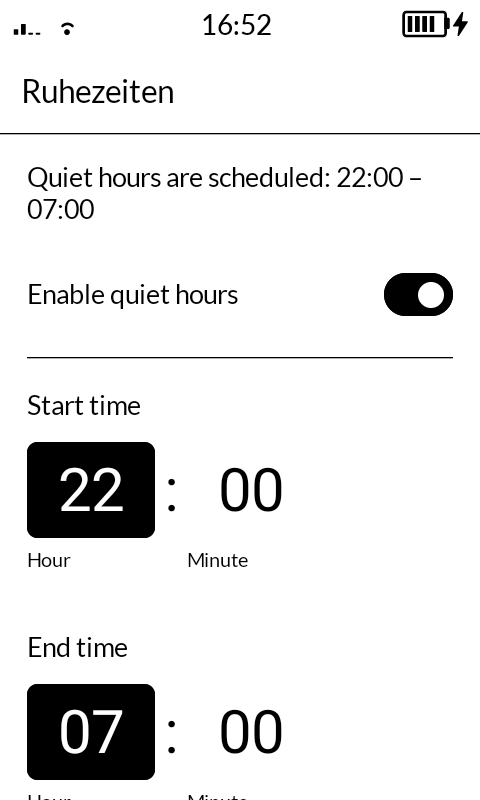
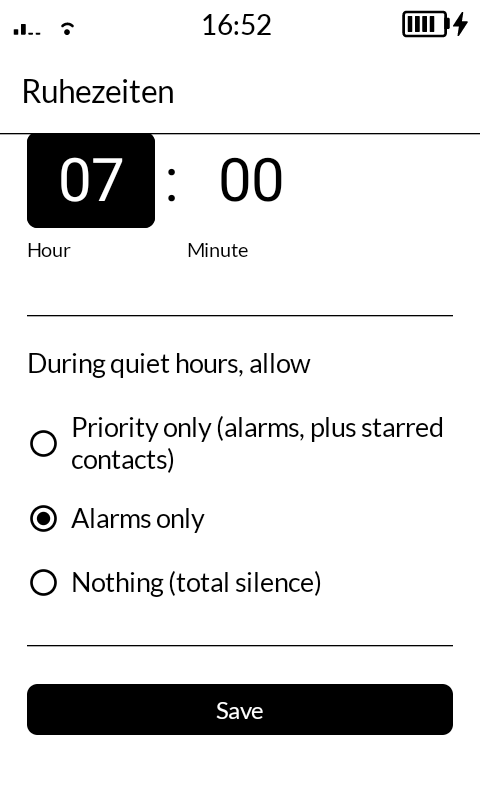

# Ruhezeiten


Scheduled quiet hours for the Mudita Kompakt.

As of this writing, Mudita has not provided a scheduled Do Not Disturb function for
the Mudita Kompakt. Ruhezeiten is a small standalone app that toggles Android's real,
system-level Do Not Disturb state on a daily schedule that you set.

## What it does

- Set a daily start time and end time for quiet hours (24-hour format).
- Choose what's still allowed through: Priority only (alarms, plus starred
  contacts), Alarms only, or total silence.
- Runs as two self-rescheduling exact alarms -- no foreground service, no battery
  drain beyond what any alarm-based app costs.
- Survives reboot.

<p>
  
  
</p>

## Disclaimer

This app was built with substantial AI assistance (Claude Code). The logic has been
tested manually on a real device -- permission flows, scheduling, and the underlying
DND behavior -- but it has not had a
professional security review or extensive real-world testing across devices, OS
versions, or edge cases. It comes with **no warranty of any kind** (see
[LICENSE](LICENSE)).

Do not rely on this app in situations where a missed or wrongly-timed notification
would have serious consequences for you -- on-call work, medical alerts,
safety-critical communications, or anything where your life or livelihood depends on
it behaving correctly every single time. Use your own judgment, read the source, and test it yourself before trusting it.

This was built primarily to meet my own needs and is shared here as a courtesy to the
Mudita Kompakt community -- not as a supported product. I don't guarantee any ongoing
support, fixes, or changes. If you want something significantly different or need a
bug fixed on a timeline, please fork it; forking and modifying under the terms of the
[license](#license) is welcome.

## Philosophy

- **E-ink first.** Built on Mudita's own [MMD](https://github.com/mudita/MMD) design
  system so the app looks and
  behaves consistently with the rest of MuditaOS K.
- **Accessible by default.** WCAG 2.1 AA is the minimum target for
  all Snoozetown projects. Please do not hesitate to notify us of any accessibility
  issues you encounter.
- **Small and simple.** No analytics, no network access, no accounts, no dependencies
  beyond what's needed to render the UI and schedule two alarms.
- **Stays open.** GPLv3 -- see [License](#license).

## What it does *not* do

- It does not manage contacts or calendars. "Priority only" reflects whatever
  contacts you've starred in Mudita's own Contacts, Dialer, or Messages apps
  (verified: starring in any of the three correctly updates the standard Android
  contacts database that this app -- and Android's DND filter itself -- reads from).
  If your authoritative contacts live somewhere that doesn't sync onto the device
  (e.g. CardDAV providers that don't currently work well with MuditaOS K), that is
  beyond the scope of this app.

### A note on "Priority only" and third-party apps

"Priority only" is Android's own system-level Do Not Disturb behavior, not something
this app implements itself -- it lets alarms through plus notifications from senders
Android considers "priority" (starred contacts, by default). This is **confirmed
working for native phone calls and SMS**, which are Android's reference
implementation for this feature.

For third-party messaging apps (Telegram, Signal/Molly, WhatsApp, etc.), whether a
message from a starred contact gets through depends on whether *that app* correctly
tags its notifications with a contact-linked sender -- something outside this app's
control, and something we have not verified for any specific third-party
app. If a starred contact's message doesn't wake the device during quiet hours, that
is a limitation of the messaging app's Android integration.

### A note on DuraSpeed (quiet hours starting or ending late)

The Kompakt's MediaTek hardware ships with a proprietary background-app killer called
DuraSpeed.
If your quiet hours are starting or ending late (anywhere from a
few minutes to nearly an hour), DuraSpeed freezing Ruhezeiten in the background while
the screen is off may be the cause.

You must enable Developer Options on the Kompakt to manage DuraSpeed settings.

If Developer Options isn't already enabled:

1. Navigate to **Settings > About** > then tap **Build number** 7 times in a row
   (you'll see an entry showing something like "MuditaOS K 1.5.0"; a message will appear
   confirming Developer options are now enabled)

Then, to exempt Ruhezeiten:

2. Navigate to **Settings > System > Developer options** > and tap the search icon (magnifying glass, top
   right) > then search for **duraspeed**.
3. Tap **DuraSpeed App info**, then tap **Open**.
4. Scroll the list to **Ruhezeiten** and toggle it on.

This does not require root. (A root-only alternative exists via apps like
[App Manager](https://github.com/MuntashirAkon/AppManager) -- DuraSpeed >
Restriction records > Lift Restriction -- but the Developer Options path above works
without it.)

## Planned features

Not yet implemented, but planned:

- **Per-day schedules** -- different start/end times for individual days, or groups
  of days (weekdays vs. weekends), instead of one schedule applying every day.
- **12-hour time display** -- currently 24-hour only. Lower priority since it's a
  display preference rather than a functional gap, but on the list.

No timeline on either -- see the Disclaimer above. If you want one sooner, a PR
implementing it is very welcome (see [CONTRIBUTING.md](CONTRIBUTING.md)).

## Installing

No root required -- this is a normal Android app.

1. Download the latest APK from [Releases](../../releases).
2. Open Mudita Center and connect your Kompakt.
3. Under **Your Kompakt**, click **Manage Files**.
4. Click **App Installers**.
5. Click **Add App Files**, then browse to and select the APK you downloaded.
6. Confirm to transfer the file to your Kompakt.
7. On the Kompakt, tap the file you added.
8. Check the box to confirm you accept the risk, then tap **Continue install**.

Mudita warns that the Kompakt may not work correctly with third-party apps, and that
you're adding them at your own risk. See the [Disclaimer](#disclaimer) above.

### Alternative: installing via ADB

If you'd rather use ADB (e.g. you already have it set up, or you're building from
source):

1. Enable USB debugging on the Kompakt and connect it to a computer.
2. Open a terminal and run `adb install ruhezeiten.apk` on the computer.

## Usage

1. Open Ruhezeiten. If any permission below isn't granted yet, you'll see a
   **Required permissions** section at the top with a button for each -- tap it,
   grant access in the system screen that opens, and come back. Once a permission
   is granted, its section disappears entirely -- there's nothing left to do about
   it, so nothing stays on screen.
2. Set your start time, end time, and what's allowed through during quiet hours
   (Priority only / Alarms only / Nothing).
3. Tap **Save**. A preview of exactly what's about to be applied appears above the
   button whenever you have unsaved changes, and a "Saved." confirmation appears
   below it once you've tapped it.

### Permissions explained

- **Do Not Disturb access** -- required for the app to change DND state at all.
  Without it, the app can't do anything; this is the one permission you actually
  have to grant yourself.
- **Exact alarm scheduling** -- required so quiet hours start/end on time rather
  than drifting by minutes to hours under Android's Doze battery optimizations. On
  this Android version, apps get this automatically at install -- you likely won't
  see a button for it at all.
- **Battery optimization** -- also needed so quiet hours start/end on time. Without
  it, Android can delay Ruhezeiten's start/end alarms while your screen is off. (This
  is separate from DuraSpeed, covered above -- you may need both.)

### FAQ / troubleshooting

**The permission section won't go away.** Check whether the permission actually got
granted -- open it again from the button; if the system screen shows the toggle
already on, force-stop and reopen Ruhezeiten (the app only re-checks permission state
when it resumes).

**Nothing happens when I tap Save.** Check to see whether the "Saved." text appears
below the button. If you don't see it, you may be looking at a cached
screenshot/stale view; try backgrounding and reopening the app.

**Quiet hours start or end late, sometimes by close to an hour.** See "A note on
DuraSpeed" above -- this is a MediaTek background-app killer separate from Ruhezeiten
itself, and it needs its own exemption via Developer Options.

## Building from source

Requires JDK 17+, the Android SDK (`compileSdk 35`, `minSdk`/`targetSdk 31` to match
MuditaOS K's Android 12 base), and Gradle (a wrapper is included).

```
./gradlew assembleDebug
adb install -r app/build/outputs/apk/debug/app-debug.apk
```

## Built with

UI is built on [Mudita Mindful Design (MMD)](https://github.com/mudita/MMD),
Mudita's own e-ink optimized Jetpack Compose component library -- pure monochrome
color scheme, no ripple/animation effects, large touch targets. See
[NOTICE.md](NOTICE.md) for attribution details.

## Contributing

Bug reports, translations, and pull requests are welcome -- see
[CONTRIBUTING.md](CONTRIBUTING.md). See [CHANGELOG.md](CHANGELOG.md) for a history
of notable changes.

## License

GPLv3 -- see [LICENSE](LICENSE). Contributions and forks are welcome; derivatives
must stay open source under the same terms.

## Support

No "buy me a coffee" link here -- I'm set on coffee. If you find this useful and
have some spare change, consider it going instead to one of these:

- [The White Line](https://www.thewhiteline.org/pages/donate) -- road safety advocacy,
  particularly protecting cyclists and improving crash investigation standards.
- [Causeway Animal Welfare Fund](https://www.charitynavigator.org/discover-charities/cause-based-giving/animal-welfare-fund/) --
  a Charity Navigator-curated fund supporting vetted organizations working on farm
  animal, wildlife, and companion animal welfare.
- [Electronic Frontier Foundation](https://www.eff.org/) -- defends digital privacy,
  free speech, and civil liberties online.

## Contact

Bugs and feature requests: please use [Issues](../../issues). For anything else,
public@snoozetown.org.
